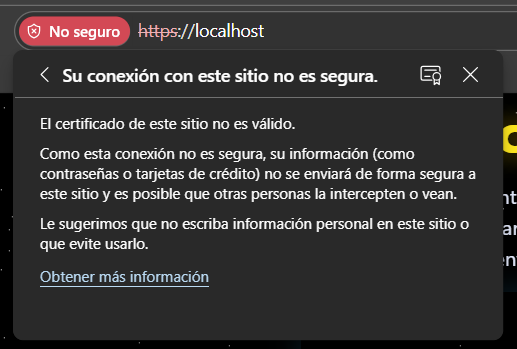
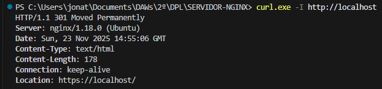

# Certificado SSL Autofirmado en NGINX con Docker

## Introducción

El objetivo de esta parte del proyecto es configurar un servidor web NGINX ejecutándose dentro de un contenedor Docker para servir contenido mediante **HTTPS** utilizando un **certificado SSL autofirmado**.  
Además, se implementa una **redirección automática de HTTP a HTTPS**, se prueban las conexiones y se verifica el funcionamiento tanto por navegador como por herramientas de consola.

---

## Entorno utilizado

- **Sistema Operativo (host):** Windows 10  
- **Contenedor:** Ubuntu 22.04  
- **Servidor Web:** NGINX (instalado dentro del contenedor)  
- **Herramienta para generar certificados:** OpenSSL for Windows  
- **Gestor de documentación:** MkDocs  
- **Docker Desktop** como motor de contenedores.

---

## Instalación del servidor web NGINX

Dentro del contenedor Ubuntu, la instalación de NGINX se realiza mediante:

```bash
apt-get update
apt-get install -y nginx openssl
```

### Archivos importantes de NGINX

- `/etc/nginx/nginx.conf`: archivo principal de configuración.
- `/var/www/app1` y `/var/www/app2`: ubicaciones donde se copian las aplicaciones servidas.
- `/etc/nginx/ssl/`: almacén donde se guardan los certificados SSL.

El Dockerfile se encargó de instalar NGINX y copiar toda la configuración necesaria.

---

## Generación del certificado autofirmado

La generación del certificado se realizó en **Windows**, utilizando la ruta absoluta de OpenSSL debido a problemas con el PATH del sistema.

### Comando utilizado:

```powershell
& "C:\Program Files\OpenSSL-Win64\bin\openssl.exe" req -x509 -nodes -days 365 `
  -newkey rsa:2048 `
  -keyout ssl/selfsigned.key `
  -out ssl/selfsigned.crt `
  -subj "/C=ES/ST=Tenerife/L=SantaCruz/O=Dev/OU=IT/CN=localhost"
```

### Significado de los parámetros:

- **req**: inicia una solicitud de certificado.
- **-x509**: genera un certificado autofirmado.
- **-nodes**: no cifra la clave privada.
- **-days 365**: duración del certificado (1 año).
- **-newkey rsa:2048**: crea una nueva clave privada RSA de 2048 bits.
- **-keyout**: ruta donde se guarda la clave privada.
- **-out**: archivo donde se guarda el certificado.
- **-subj**: define los datos del certificado sin necesidad de interacción.

### Ubicación de los archivos generados

Los certificados se guardaron en:

```
project/
 └── ssl/
      ├── selfsigned.key
      └── selfsigned.crt
```

Estos archivos se copian dentro del contenedor a:

```
/etc/nginx/ssl/
```

---

## Configuración SSL en NGINX

Se modificó el archivo `nginx.conf` para:

1. Añadir redirección automática de HTTP → HTTPS  
2. Configurar dos servidores HTTPS (app1 y app2)  
3. Activar los certificados generados

### Redirección HTTP → HTTPS

```nginx
server {
    listen 80 default_server;
    server_name _;

    return 301 https://$host$request_uri;
}
```

### Servidor HTTPS para app1

```nginx
server {
    listen 443 ssl;
    server_name app1;

    ssl_certificate     /etc/nginx/ssl/selfsigned.crt;
    ssl_certificate_key /etc/nginx/ssl/selfsigned.key;

    root /var/www/app1;
    index index.html;

    location / {
        try_files $uri $uri/ =404;
    }
}
```

### Servidor HTTPS para app2

```nginx
server {
    listen 444 ssl;
    server_name app2;

    ssl_certificate     /etc/nginx/ssl/selfsigned.crt;
    ssl_certificate_key /etc/nginx/ssl/selfsigned.key;

    root /var/www/app2;
    index index.html;

    location / {
        try_files $uri $uri/ =404;
    }
}
```

---

## Construcción y ejecución del contenedor

### Construir la imagen:

```bash
docker build -t nginx-ssl .
```

### Ejecutar el contenedor:

```bash
docker run -d --name nginx-ssl -p 80:80 -p 443:443 -p 444:444 nginx-ssl
```

---

## Pruebas

### ✔ Verificación por navegador

- Acceder a: `https://localhost/`  
- Aviso de certificado no confiable → esperado por ser autofirmado.  
- Página servida correctamente por HTTPS.



### ✔ Prueba CURL: HTTP → redirección

```bash
curl -I http://localhost
```

Salida esperada:

```
HTTP/1.1 301 Moved Permanently
```


### ✔ Prueba CURL: HTTPS app1

```bash
curl -kI https://localhost
```

### ✔ Prueba CURL: HTTPS app2

```bash
curl -kI https://localhost:444
```

---

## Conclusiones

- Se logró configurar un entorno seguro con NGINX usando HTTPS dentro de Docker.  
- La redirección HTTP a HTTPS funciona correctamente.  
- El certificado autofirmado se generó sin dependencias adicionales dentro del contenedor.  
- Se comprobó funcionamiento desde navegador y CLI.

### Posibles mejoras

- Usar certificados reales con **Let's Encrypt**.  
- Implementar **HSTS** para seguridad adicional.  
- Automatizar la renovación de certificados.  
- Crear un script que genere certificados y reconstruya el contenedor automáticamente.