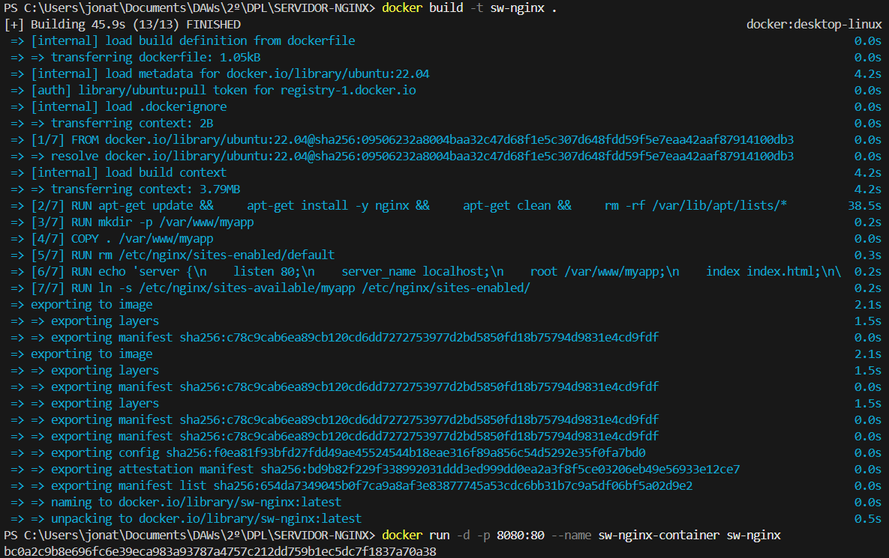

# Instalación de Nginx en Docker

En esta sección se explica cómo instalar **Nginx** dentro de un contenedor **Docker**, partiendo desde una imagen base de **Ubuntu 22.04**, sin usar imágenes preconfiguradas.

---

## 1️. Crear el Dockerfile

En la raíz del proyecto, crea un archivo llamado `Dockerfile` con el siguiente contenido:

```dockerfile
FROM ubuntu:22.04

# Evita prompts interactivos
ENV DEBIAN_FRONTEND=noninteractive

# Instalamos Nginx y limpiamos basura
RUN apt-get update && \
    apt-get install -y nginx && \
    apt-get clean && \
    rm -rf /var/lib/apt/lists/*

# Copiamos las dos apps
COPY app1 /var/www/app1
COPY app2 /var/www/app2

# Copiamos la configuración personalizada de Nginx
COPY nginx.conf /etc/nginx/nginx.conf

# Damos permisos correctos
RUN chmod -R 755 /var/www && chown -R www-data:www-data /var/www

# Exponemos los puertos de ambas apps
EXPOSE 80 81

# Comando por defecto: inicia Nginx en primer plano
CMD ["nginx", "-g", "daemon off;"]
```

---

## 2️. Construir la imagen Docker

Desde PowerShell o terminal, dentro del proyecto, ejecuta:

```bash
docker build -t sw-nginx .
```

Esto creará una imagen llamada **sw-nginx** basada en Ubuntu con Nginx instalado.

<p align="center">
  
</p>

---

## 3️. Crear y ejecutar el contenedor

Ejecuta el contenedor con:

```bash
docker run -d -p 8080:80 --name sw-nginx sw-nginx
```

Esto hará que:

* El contenedor se inicie en segundo plano.
* El puerto 80 del contenedor se exponga al 8080 local.
* El contenedor se nombre como `sw-nginx`.

---

## 4️. Verificar instalación

Abre tu navegador y entra a:

```
http://localhost:8080
```

Deberías ver la página de bienvenida por defecto de Nginx.
